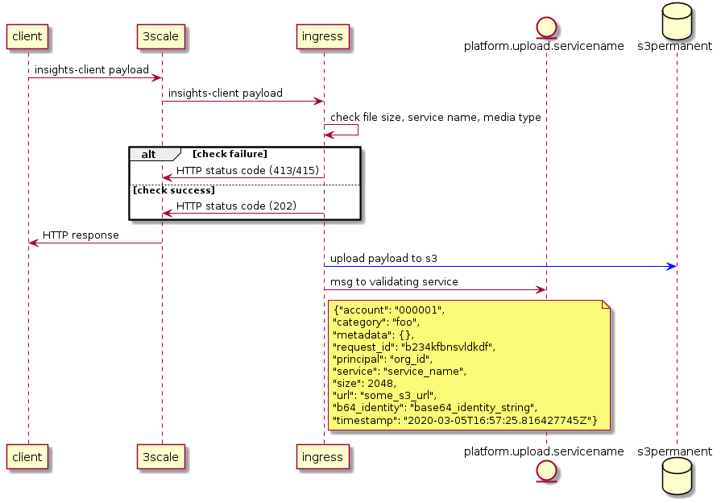

The Ingress service is responsible for storing and directing incoming
payloads to the end service they are destined for. It has connections to
the Kafka Message Queue, and Amazon S3 for storing the files.

Ingress sits behind the 3Scale gateway which provides authentication,
routing, and assignment of a unique ID for each payloads.

[Code
Repository](https://www.github.com/RedHatInsights/insights-ingress-go)

## How It Works

The following sequence diagram shows the data flow for payloads entering
the platform.

The Ingress workflow is as follows:

  - The source client sends a payload of a specific content type to
    cloud.redhat.com

  - Ingress discovers a validating service from the content type,
    uploads the file to cloud storage, and puts a message on a kafka
    topic for that service.

Every upload is required to attach the following content-type in order
to be accepted into the platform:

  - application/vnd.redhat.\<service\_name\>.some-identifier+tgz

The service name will be used to decide which topic the payload is meant
to go to. For example: `  vnd.redhat.advisor.file+tgz  ` = ` 
platform.upload.advisor  `

### Message Formats

All messages placed on Kafka by Ingress will contain JSON with details
about the upload. They will contain the following structure:

    {
     "account": "<account number>",
     "org_id": "<org_id>",
     "category": "<currently translates to filename>",
     "request_id": "<uuid for the payload>",
     "principal": "<currently the org ID>",
     "service": "<service the upload goes to>",
     "size": "<filesize in bytes>",
     "url": "<URL to download the file>",
     "id": "<host based inventory id if available>",
     "b64_identity": "<the base64 encoded identity of the sender>",
     "timestamp": "<the time the upload was received>",
     "metadata": "<will contain additional json related to the uploading host>"
    }

### Errors

Ingress will report HTTP errors back to the client if something goes
wrong with the initial upload. It will be the responsibility of the
client to communicate that connection problem back to the user via a log
message or some other means.

The connection from the client to Ingress is closed as soon as the
upload finishes. Errors regarding anything beyond that point (cloud
storage uploads, message queue errors) will only be reported in Platform
logs. If the expected data is not available in cloud.redhat.com, the
customer should engage with support.

## Development

### Prequisites

Golang \>= 1.12

### Launching the service

Compile the source into a go binary

    $> go get -d ./...
    $> go build

Launch the application

    ./insights-ingress-go

### The Docker Option

You can also build Ingress using Docker/Podman with the provided
Dockerfile

    $> docker build . -t ingress:latest

Or you can stand up the stack with the provided docker-compose

    $> docker-compose up

### Uploading a file locally

Ingress expects to be behind a 3Scale gateway that provides some
manadatory headers. You can provide these headers manually with a curl
command

    $> curl -F "file=@somefile.tar.gz" -H "x-rh-identity-header: <base64 string"> -H "x-rh-request_id: testtesttest" http://localhost:3000/api/ingress/v1/upload

For testing, the following base64 identity can be used:

    eyJpZGVudGl0eSI6IHsiYWNjb3VudF9udW1iZXIiOiAiMDAwMDAwMSIsICJpbnRlcm5hbCI6IHsib3JnX2lkIjogIjAwMDAwMSJ9fX0

This decodes to

    {"identity": {"account_number": "0000001", "internal": {"org_id": "000001"}}}

### Testing

Use `  go test  ` to test the application

Testing Konflux

    $> go test ./...

